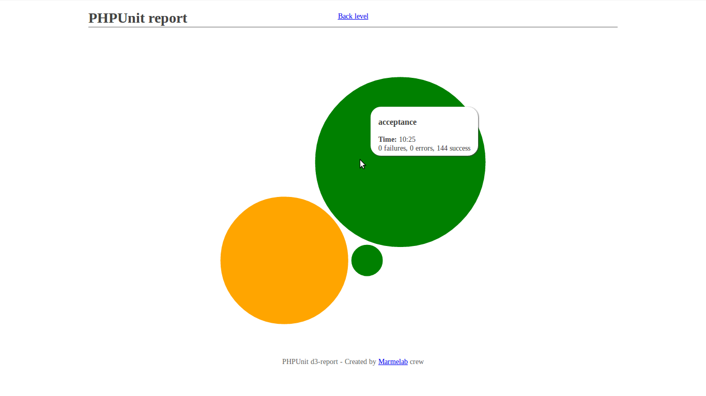

# PHPUnit d3 report

This visualization tool provides a quick way to monitor your PHPUnit test suites. With a single glance, you will be able to identify the slowest tests, helping you to improve the overall execution time of your tests.

Here is what Symfony2 test suite report looks like:



For live demonstration and online report generation, here is the [demo page](http://marmelab.com/phpunit-d3-report/).

## How to generate a report?

To generate a report, simply execute your PHPUnit test suite including the `--log-junit` argument, such as:

``` sh
phpunit --log-junit report.xml
```

Then, simply copy-paste your XML report into the report form, and let the magic happen!

Note: if you want to open this project locally, you will have to create a VirtualHost to see the default Symfony2 report. Indeed, it is stored as a pre-computed JSON, and opening it will raise a cross-domain security issue from your browser.

## Installing the project locally

If you want to install this project locally, simply clone the [GitHub repository](https://github.com/marmelab/phpunit-d3-report) and install its Bower dependencies:

``` sh
# Cloning repository
git clone https://github.com/marmelab/phpunit-d3-report

# Installing dependencies
bower install
```

## Re-using the chart

This chart has been thought to be easily re-usable. This way, you can embed it and customize the resulting chart in your own application.

To create a new chart, simply prepare the PHPUnit XML report thanks to `ReportTransformer` class, pass resulting JSON to the container element and call the chart function:

``` js
var chart = d3.chart.phpunitBubbles();

d3.json("reports/report.xml", function(err, data) {
    d3.select("#bubbles")
        .datum(ReportTransformer.transform(data))
        .call(chart);
});
```

If you want to display a single report (for instance, on your project page), you do not need the `ReportTransformer`. Simply download the converted JSON report from the [GitHub page](http://marmelab.com/phpunit-d3-report/), just under the chart. Then, you can query directly the report, skipping the transformation process, and thus optimizing performances.

``` js
d3.json("reports/phpunit-d3-report.json", function(err, data) {
    d3.select("#bubbles").datum(data).call(chart);
});
```

### Parameters

If you want to customize the output report, several paramaters are available as functions, following the [Mike Bostock's re-usable chart pattern]. For instance, if you want to modify the padding of each bubble, use:

``` js
var chart = d3.chart.phpunitBubbles().padding(10);
```

Here is the list of all available parameters:

* **width**: width of report in pixels (default: 900)
* **height**: height of report in pixels (default: 900)
* **padding**: margin between each bubbles in pixels (default: 1)
* **className**: class name of bubbles container (default: bubbles)
* **sort**: sorting closure to order bubbles (default: random order)
* **onMouseOver**: event when mouse enters on a bubble (default: display a tooltip with test details)
* **onMouseMove**: event when mouse moves inside a bubble (default: update the tooltip describing the test)
* **onMouseOut**: event when mouse moves outside a bubble (default: hide the tooltip)

For instance, here is a full customized chart:

``` js
var chart = d3.chart.phpunitBubbles()
    .width(800)
    .height(600)
    .padding(3)
    .className("report")
    .sort(function(a, b) {
        return a.value - b.value;
    })
    .onMouseOver(function(test) {
        console.log("Entering " + test.name);
    })
    .onMouseMove(function() {})
    .onMouseOut(function(test) {
        console.log("Exiting " + test.name);
    });
```

## Licence

<p>This project is released under the MIT licence (thanks to [Marmelab](http://www.marmelab.com) courtesy). It means you can blow unlimited bubbles in all your projects, with the only obligation to embed the original licence file into your fork.</p>

## Contributors

A special thanks to all contributors of this project:

* [Jonathan Petitcolas](http://www.jonathan-petitcolas.com)
* [François Zaninotto](http://redotheweb.com)
